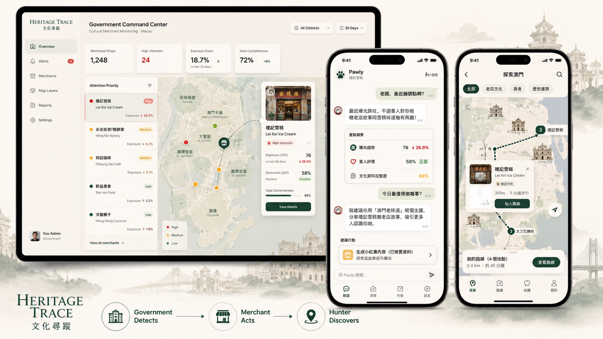

# Heritage Trace · 文化尋蹤

> 讓被忽略的城市文化，重新被發現、理解與看見。

Heritage Trace 是一套以澳門文化商戶為核心的共享系統，串連文化資料發現、證據核實、商戶行動與旅客探索。



## 什麼是 Heritage Trace？

許多具有文化價值的老店並不是沒有故事，而是故事散落在公共資料、地方記憶、商戶脈絡與旅客訊號之間。Heritage Trace 將這些片段整理成一個容易理解、可以追溯的文化體驗。

系統以同一份 heritage shop record 連結政府發現、資料核實、商戶支援與旅客探索。政府可以更快找出需要關注的商戶；商戶可以根據可靠的文化資料和經營訊號採取行動；旅客則能在地圖與路線中重新遇見城市裡容易被忽略的地方。

Heritage Trace 希望建立一條清晰的文化循環：**被忽略 → 被發現 → 被理解 → 被活化 → 被重新看見**。它不是一個靜態檔案庫，而是讓文化記憶重新回到日常城市生活的共同入口。

## 三種體驗

以下是同一套系統的三個使用介面，而不是三個分開的產品：

| 介面 | 作用 |
| --- | --- |
| **Government** | 以地圖為核心，找出需要關注的文化商戶。 |
| **Merchant / Pawly** | 將已核實的文化資料與商戶訊號轉化為可執行建議和有根據的內容。 |
| **Hunter** | 以地圖和路線協助旅客發現文化商戶。 |

三個介面共享同一個 shop identity 和已核實的 heritage story，只按照不同角色的需要調整互動方式。

## 如何運作

```text
Heritage sources
        ↓
QwenPaw Workflow
        ↓
Verified heritage  +  Exposure / Sentiment signals
        ↓
Paw-Insight
        ↓
Government / Merchant / Hunter
```

Workflow 負責收集、整理與核實文化證據。Paw-Insight 將已核實的文化資料，與 exposure、sentiment 等商戶訊號結合，產生可解釋的關注優先次序、建議行動與內容提示。只有符合公開使用規則的資料，才會傳遞到 Merchant 和 Hunter 介面。

## Demo Routes

- `/` — Heritage Trace 入口
- `/government` — 政府文化商戶監察
- `/merchant` — 商戶 Pawly 助手
- `/hunter` — 旅客地圖與路線探索

共享示範商戶可以直接開啟：`/government?shop=lei-kei-001`

## Tech Stack

Next.js 16 · React 19 · TypeScript · Tailwind CSS 4 · shadcn/ui · Zustand · Zod · Lucide React · D3 Geo / TopoJSON · Vitest · Testing Library · Biome · openapi-typescript · Husky · lint-staged

## 本地開發

```bash
npm install
npm run dev
```

驗證指令：

```bash
npm run typecheck
npm run test
npm run lint
npm run build
```

## 狀態

Heritage Trace 目前是一個持續開發中的產品原型，現階段包含：

- Government 地圖優先的文化商戶監察
- Pawly 商戶助手
- Hunter 路線探索
- 共享示範商戶資料
- Paw-Insight 建議層
- QwenPaw Workflow 整合進行中

## 資料說明

Exposure、sentiment、comments 及部分商戶情境可能使用 deterministic demo data；準備公開使用的文化資料則遵循專案的核實與 publication 規則。

## Attribution

- 前端原始基礎來自 `next-shadcn-admin-dashboard`。
- 澳門地圖幾何資料來自澳門特別行政區政府統計暨普查局（DSEC）的 GIS 資料。
